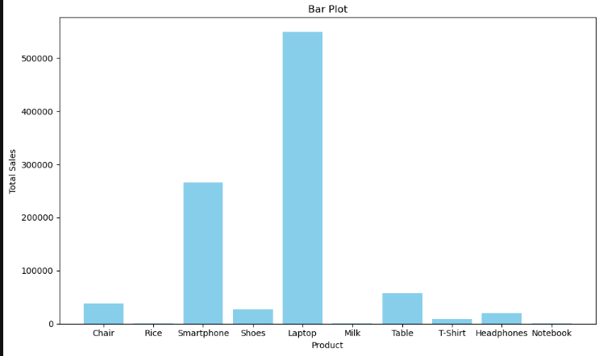
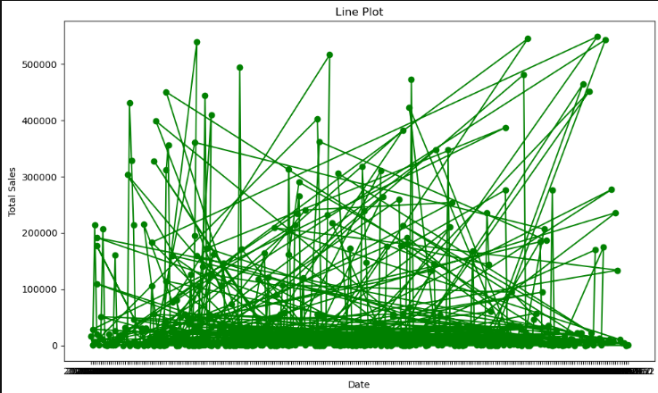
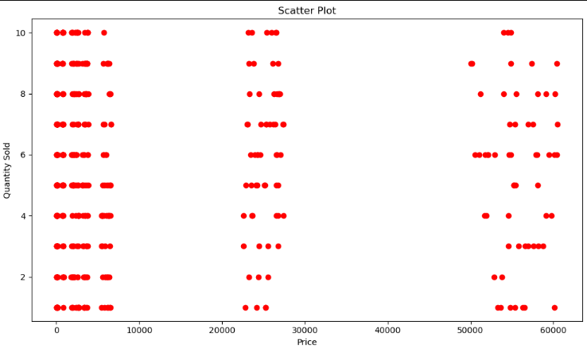
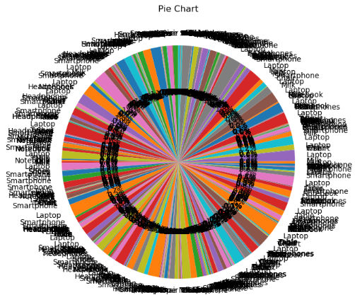
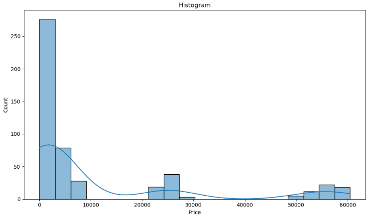
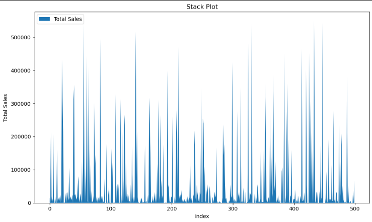

<div align="center">

# 📊 Data Analysis & Visualization Program

### 📈 Interactive Python Program for Data Analysis & Data Visualization


---


</div>

---

# ╰┈➤ˎˊ˗ Introduction

The **Data Analysis & Visualization Program** is a Python-based interactive application that allows users to analyze CSV datasets through a simple menu-driven interface.

The project provides data exploration, missing value handling, descriptive statistics, and multiple visualization techniques using **Pandas**, **NumPy**, **Matplotlib**, and **Seaborn**.

It is designed for beginners who want to understand the complete workflow of data analysis using Python.

---

# ╰┈➤ˎˊ˗ Project Objectives

➠ Load CSV Dataset

➠ Explore Dataset

➠ Display Dataset Information

➠ Handle Missing Values

➠ Generate Descriptive Statistics

➠ Perform DataFrame Operations

➠ Create Multiple Data Visualizations

➠ Save Generated Charts

---

# ╰┈➤ˎˊ˗ Technologies Used

| Technology | Purpose |
|------------|---------|
| Python | Programming Language |
| Pandas | Data Analysis |
| NumPy | Numerical Operations |
| Matplotlib | Data Visualization |
| Seaborn | Statistical Visualization |

---

# ╰┈➤ˎˊ˗ Features

➠ Load CSV Dataset

➠ Display First & Last Records

➠ Display Column Names

➠ Display Data Types

➠ Dataset Information

➠ Check Missing Values

➠ Fill Missing Values

➠ Drop Missing Values

➠ Replace Missing Values

➠ Generate Descriptive Statistics

➠ Bar Plot

➠ Line Plot

➠ Scatter Plot

➠ Pie Chart

➠ Histogram

➠ Stack Plot

➠ Save Generated Graphs

---

# ╰┈➤ˎˊ˗ Visualizations Included

## ➠ Bar Plot

<p align="center">

</p>

---

## ➠ Line Plot

<p align="center">

</p>

---

## ➠ Scatter Plot

<p align="center">

</p>

---

## ➠ Pie Chart

<p align="center">

</p>

---

## ➠ Histogram

<p align="center">

</p>

---

## ➠ Stack Plot

<p align="center">

</p>

---

# ╰┈➤ˎˊ˗ Project Structure

```text
Data-Analysis-Visualization/

│
├── data_visualizer.py
├── retail_sales.csv
├── README.md
│
└── images/
    ├── bar_plot_total_sales.png
    ├── line_plot_sales_trend.png
    ├── scatter_price_vs_quantity.png
    ├── pie_chart_product_share.png
    ├── histogram_price_distribution.png
    └── stack_plot_sales_index.png
```
---

# ╰┈➤ˎˊ˗ Program Menu

```text
1. Load Dataset
2. Explore Data
3. Perform DataFrame Operation
4. Handle Missing Data
5. Generate Descriptive Statistics
6. Data Visualization
7. Save Visualization
8. Exit
```

---

# ╰┈➤ˎˊ˗ Project Structure

```text
Data-Analysis-Visualization/

│
├── data_visualizer.py
├── retail_sales.csv
├── README.md
│
└── images/
    ├── bar_plot.png
    ├── line_plot.png
    ├── scatter_plot.png
    ├── pie_chart.png
    ├── histogram.png
    └── stack_plot.png
```

---

# ╰┈➤ˎˊ˗ How to Run

### Clone Repository

```bash
git clone https://github.com/your-username/Data-Analysis-Visualization.git
```

### Install Required Libraries

```bash
pip install pandas numpy matplotlib seaborn
```

### Run Project

```bash
python data_visualizer.py
```

---

# ╰┈➤ˎˊ˗ Sample Output

✔ Dataset Loaded Successfully

✔ Missing Values Handled

✔ Statistics Generated

✔ Graph Displayed Successfully

✔ Visualization Saved Successfully

---

# ╰┈➤ˎˊ˗ Learning Outcomes

➠ Python Programming

➠ CSV File Handling

➠ Pandas DataFrame Operations

➠ Data Cleaning

➠ Missing Value Handling

➠ Descriptive Statistics

➠ Data Visualization

➠ Matplotlib

➠ Seaborn

➠ Interactive Menu Driven Programming

---

# ╰┈➤ˎˊ˗ Author

**Kalpesh Patil**

Python Developer | Data Analysis Learner

---

<div align="center">


</div>
